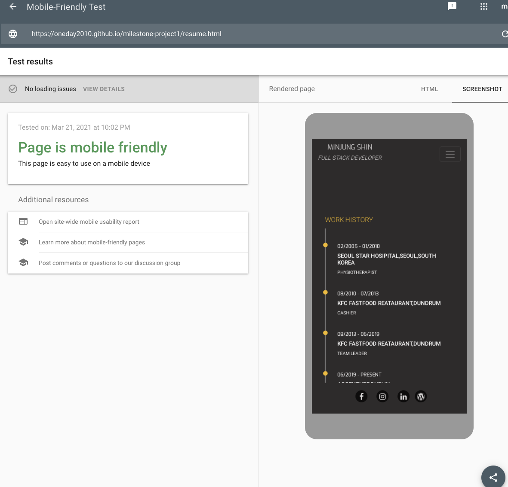

# Minjung Shin portfolio 

[View the live project here](https://oneday2010.github.io/milestone-project1/) 

### This is personal portfolio website for Minjung Shin. It is designed to be responsible and accessible on a range of devices, making it easy to navigate for potential employs and clients. 

<!-- after project finish, imag screenshot should be here with L/M/S size-->

---
---
## Table of contents
---

[Overview](#overview)

[Description](#description) 

[Ux](#ux) 

[Features](#features) 

[Technologies](#technologies) 

[Testing](#testing) 

[Deployment](#deployment) 

[Credits](#credits) 

## Overview
---
I tried to create website as simple as possible and clear outlook  for main purpose. Main purpose of this site is appealing  personal work history and skills to attract employ/client. Therefore, all the pages are related to work, career path and achievements. I avoided  use too much contents and images. I focused to more user experience and send clear idea to the user that what this site for. 

## Description
---
This is Minjung Shin’s personal portfolio. The main aim is clear that deliver Minjung Shin work/career path to target users and attracting their interest. I tried to deliver essential information in related to work and focus to positive user-experience on the site. 

## UX
### User experience
---

### Strategy
---

 Main target user : Employee /Client /Recruiter 

this website is mainly create to introduce Minjung Shin’s work history/skills, general information and building better personal portfolio
which will lead to more job opportunity and better job experience. Therefore, I want to make the website that users are easily understand and catch the information as  they look for to it. Moreover, it will be the best way to present Minjung Shin’s skill and knowledge  as software developer through this website which will be part of finished project. 

-  Business Goals

Present accurate information related Minjung Shin’s career base

2) Provide professional personal portfolio website for any type of user can find the information easily 

3) keep development  personal skill through the site, offer more engage with user by social media link. Open the more opportunity and deliver simple and strong message to user about job ability and ambition. 

4) Answer that most important question “ Why you need to hire me”

 - User Stories

"I want to know what kind of work Minjung Shin has been doing, and what kind of skill she has." 

"There are so many people who want a get a job as software developer, I need to know this person is right person I’m looking for."

"I don’t have time to read all of the CVs, I want to see simple and clear information that she has skill that what I need now."

"I want to be sure that Minjung can do the work as she say on the site . When I check the project she has been doing and has done gave me clear idea." 

"I’m looking for someone has similar style of work and goal. I want to know what type of person she is and what kind of goal she has in professionally ."

### Scope
---

 - Requirements

 * Collaborator/Recruiter/Employee

There are ability to view skillsets by work history, my skill as well as lists of projects had been done
Ability to view contact detail on personal info section, social link attached
Ability to submit project outline - shows clear ability by site present and deliver information what collaborator look for. 

### structure
---

This site created simple structure. Focus on providing information what user look for and easily get in touch with Minjung Shin. Nav and Footer is focus allow the user to easily find ways to navigate the whole site and get extra information through the download CV, social media links. 
Each pages has simple idea and lead to next pages. Welcome the user and explain about Minjung’s work as well as work history, skillset. Finally when user come to contact page, it is more  easier  that  convince user to get in touch.  

### Skeleton
—
There are some change between original wireframes and final site, however, most of there are same as planned. 
When I start the site, I want to present my own photo to rise creditability. However I choose all the images more related to work wise. I want to give impression to user that this is more focus on professionally rather than personally.  Name and title will give clear idea about the site concept and choose minimal contacts to deliver only important information to user. I wish all the user found information. All nav and social icons present clear and easily found, try to give consistency through the pages.

 #### Wireframes
This website have four pages. The wireframes do not match with my final projext exactly, however, I can say almost as planed. 
 - Landing Page: welcoming page
 
  

 - Explain about Minjung Shin's generl info and achievement Page: 
 
 

 - Work history & infomation Page:

  

 - Contact Page:
 
 

### Surface
—

I want to keep the consistency as professional work concept whole the pages. Choose dark background color and white color text tones of nav and footer , So user can easily navigate all the menu. Also, use yellow color of texts to emphasise some of body titles to catch the attention. Try to publish simple and accurate information. Therefore, all the fonts and icons colors are consistence and repeated.  

 #### Design

  - Color Scheme : Mainly Black and white. And use bright yellow color to emphasis some of headlines. 

  - Typography : Mainly  "Exo", sans-serif font and "Roboto", sans-serif font used through out the whole website. I try to make all pages look simple and as same time all the pages have same concept. 

  -  Imagery : I used three images. First one with simply and modern style laptop, small illustration of girl and programming hands. I tried to all the concepts are related professional work concept with each pages. 

## Features
---
* ## Existing Features

Great responsiblity, Simple and direct message deliver
### navbar
I created fixed-top navbar, Name and title on the left and other nav menu on right side.  when user click Name and title, I set this text as going back to home link, So user can always back to home page. Moreover, when user click the navbar menu, it easily direct to desire page as well as it has visual difference to easily  guide to user which page user are looking at it. Nav menu changed to dropdown as screen size get reduce for user's convenient. 

### HOME
Home page is simply created with  three big part. Nav on the fixed top and Footer on the fixed bottom. Welcome message on Jumbotron, link contact with Contact page. So it attract user with simple and straight forward message.  

### ABOUT
Nav on the top and Footer on the bottom fixed. There are nice girl images to catch the user’s eye as positive and creative page image. This page is contain personal targets and achievement simple lists of educations and projects have done ( further improvement require to linked with real projects). Very simple page structure however, deliver simple message to user that why they need to hire Minjung Shin. 

### RESUME
Nav on the top and Footer on the bottom fixed . This pages focus on Minjung Shin’s work history and Personal information as well as Skill in relate with full stack development. Work history create with vertical line as timeline, easily understandable. Moreover use progress bars with different colours used for better send required information to user. 

### CONTACT
Contact page is same structure as Home page. Nav and Footer up and down as well as Form content on the middle. Form content offer to user can engage by sharing their information. Moreover it works as  communicating tool with site creator. 

### Footer
Footer is fixed-bottom all the pages. It contain two part. left with download CV and Right social media links menus. When user like to download CV, the icon click can be open new window contain Minjung Shin’s CV which can downloadable . More over all the social media links are linked Minjung Shin’s personal social media links. Therefore user can easily engaged and get more information about the person. When the window size get reduce on average phone size, download menu disappear and only social media menu align to right corner to look simpler . 

* ## Features left to implement

I create this website to do my first milestone as well as real use for personal portfolio. I would like to grow the site as I grow my knowledge, skill and career development. I need to update all the information as personal grow. Moreover, I like to have real link connect with my mini project titles. I would like to create gallery pages updates real life images (memories and achievements). Also, more projects can be display  in this site in future. 

 

## Technologies
### Technologies Used
---

* ### Languages Used
HTML5,CSS3

* ### Frameworks,Libraries & Programs Used
1)[bootstrap4.5](https://getbootstrap.com/docs/4.5/getting-started/introduction/) -Bootstrap was used to assist with the responsiveness and styling of the website

2)[Hover.css](https://cdnjs.com/libraries/hover.css/2.1.1) - Hover.css was used on the Social Media icons in the footer to add the float transition while being hovered over. 

3)[Google Fonts](https://fonts.google.com/specimen/Oswald?preview.text_type=custom)
Google fonts use for most of headlines and paragraphs. 

4)[Font Awesome](https://fontawesome.com/)
Use bootstrap4/font awesome version. It used on all pages throughout the website to add icons 

5)[Balsamiq](https://balsamiq.com/wireframes/) - used to create the wireframe during the design process.

## Testing 
---
* ### Testing User Stories from User Experience (UX) section

 - Testing user story goal

As a First time visitor, I want to deliver clear message to the user that what is this site about without too much send information.Homepages is simple and direct welcoming message with bring up curious to user that more information about Minjung Shin. It may looks lack of images or no attracting contains are popping up, but tried to simple as possible for lead user to next pages. In About page, I wish user catch the Minjung shin’s goal, ambition, Also this person is right person for recruiter’s needs. Brief  explanation about personal and career achievement about Minjung Shin’s work . Therefore it gives better idea that why user need to hire or work with her base on the information. When user get resume page, it gives clear idea of Minjung Shin’s work experience as well as work skill. All information will help to make decision to contact or chat with Minjung Shin on last contact page eventually. I wanted make all the pages has step by step stage to deliver clear messages to user. So user could get right information and help to make right decision for both side.  

 - Forms testing: To make sure the website was working as it supposed to be. I tested form on CONTACT page tried input diffrent information on name/email/project section. when I tired input wrong formet of email section I got warning to make sure input right form of email. 
 also, each form is required to be filled to send, as well as I tried to check the data is going right link, use below link. 

texting form data used the [link](https://formdump.codeinstitute.net),
 
  <form action="https://formdump.codeinstitute.net" method="POST">. The input data when to the link and I was able to see the data was send to correctly.
   After I just tested and edit "contact page" HTML code, make sure there is no error. 

 
 - Links : I checked all the links directed to desired location. Such as all nav links well linked as well as social links are well too. One thing I would like to metion it is each social link (facebook,linkedin,instagram,wordpress)are real my personal link. I used my real personal link to make the portapolio looks trustworthy. 
 Moreover, link hovered color change to white to birght white, make sure direct user easily. 

 - Testing across various devices ( I used Browser Stack as well as my one device and friends. the devices blows works without issue, however, I found some issue with very old version of device from BrowerStack such as iphone 5. I edit media queries, it worked better )
   * Android mobile: Galaxy s9
                     oneplus 8
                     pixel4
   * IOS mobile:iPhone 11, 6s,12,12pro
   * IOS table:ipad pro 2017 ,
   *  Android tablet : Samsung galaxy tob s6
   * laptop:macbook 13inch 2014

 - Ensured the website was also responsive on all the pages [Google Mobile Friendly Test](https://search.google.com/test/mobile-friendly?utm_source=gws&utm_medium=onebox&utm_campaign=suit) 
   - Home 
   - About 
   - Resume 
   - Contact
 
  - I tested on Safari,Chrome, Firefox it was performed without issue. 

 #### Validation
 - [W3C Markup Validator](https://validator.w3.org/) : 
 When I first tried to the validate my HTML, I got stray line error which I didn't understand. I finally realise that I allocate </footor> under  </body>. all other error also, sorted. 

 

 There was no further issues.

 - [W3C CSS Vaildator](https://jigsaw.w3.org/css-validator/) 
 
 

#### project bug and solution

 I got issue with centric the form from the background images, I tried to reset margin and padding and couldn't sorted the issue. I got help from tutor, advice me use Aligner to centralise . It solved the issue on HOME page and CONTACT page. 

I found gap from contaier of section element when screen size went to smaller. I tried to rebuilt the each container as well as div, after work as well as media queries set, problem solved. 

I found issue start from Nav bar grid was set wrongly. It was affected all the grid on body container. I rebuilt all grid on About page, and the issue got sorted. 

  - Bug found after load the website in different browser. I tested Chrome,Safari and Firefox with Iphone 11. There is no issue with Chrome browser, however, it shows navbar and body separations on Safari and Firefox brower. 
no functional failure all the browser. When user touch the apart from nav, the container was moving separately. Hardly notice laptop user. It is noticeable when user touch screen with finger. 

## Deployment
---
1)Firstly I create the account part of my CSS course on code institute. After practicing mini project, I could get idea to use Gitpod as well as GitHub. I created new repository to start my project and put name as “milestone-project1”

2)After get my own repository for my project I start work all coding and update all my files on Gitpod. 

3)Gitpod, a cloud-based version control software or IDE was used to write all code for this project. 

4)Each day when I done, I save the data and when all the work was done, I went to Github pages and check the setting menu and found the Github pages. I selected the Master Branch and it automatically create URL address. 

5)To access the code,, I can get clone which provides an URL and I can use my phone or any device, or download as zip file on the device.  - 

## Credits
---
* ### Content

Most of contents are original from myself. However, there are coding help from Code institute course User Centric Frontend Development -> resume-miniproject-bootstrap4. 
Especially "Work history"/"My Skill" from the course were great help.  I got many good idea from [w3school](https://www.w3schools.com/html/html5_semantic_elements.asp).

* ### Media

All the image files I got from "https://pixabay.com/"
there are three images I used this site
1) [Home background image]( https://pixabay.com/photos/laptop-desk-workspace-workplace-336373/)
2) [About girl](https://pixabay.com/illustrations/watercolor-portrait-character-girl-1020509/)
3) [Contact](https://pixabay.com/photos/student-typing-keyboard-text-woman-849822/)

* ### Acknowledgements

I received inspiration for this project from 

1) [Code institute](https://learn.codeinstitute.net/ci_program/diplomainsoftwaredevelopment)

User Centric Frontend Development-> mini project ( Resume)

2) Code institute->CSS Essentials->Love Running

3) Code institute->User Centric Frontend Development->Bootstrap4->Whiskey Drop 

4) I got great help from elerel's [readme reference](https://github.com/elerel/ms1-go2snow/blob/master/README.md#overview)

5) My Mentor,Nishant Kumar, and many tutors(Jo,Alan,Scott,Tim) gave me great help throughout this project.

